# Sistema de Información de Notas y Asistencias para Colegios

Este proyecto tiene como objetivo desarrollar un **Sistema de Información de Notas y Asistencias** para colegios, que permita gestionar de manera eficiente la información académica de los estudiantes, incluyendo notas, asistencias, asignaturas, cursos escolares. El sistema está diseñado para ser utilizado por administradores, docentes y estudiantes, cada uno con roles y permisos específicos.

---

## Requisitos del Sistema

### Requisitos Funcionales

1. **Gestión de Usuarios**:
   - Inicio y cierre de sesión para todos los usuarios.
   - Cambio de contraseña.
   - Creación, modificación y eliminación de usuarios por parte de los administradores.
   - Asignación de roles y permisos.
   - Registro de estudiantes a cursos y grupos.
   - Actualización de información personal por parte de docentes y estudiantes.
   - Consulta de información de estudiantes por parte de administradores y docentes.

2. **Gestión de Asignaturas y Cursos**:
   - Registro de asignaturas y asignación de docentes.
   - Consulta de asignaturas por curso para administradores, docentes y estudiantes.

3. **Gestión de Notas**:
   - Registro, edición y actualización de notas por parte de los docentes.
   - Consulta de notas según el rol del usuario.
   - Generación de reportes de notas por parte de administradores.

4. **Gestión de Asistencia**:
   - Registro, edición y actualización de asistencias por parte de los docentes.
   - Consulta de asistencias por parte de administradores, docentes y estudiantes.

---

### Requisitos de Comportamiento

1. **Reglas de Negocio**:
   - Un estudiante solo puede estar asignado a un único curso y grupo.
   - Un docente solo puede ingresar notas y asistencias para sus asignaturas asignadas.
   - Las notas no pueden ser modificadas después del cierre del período académico, salvo autorización del administrador.
   - Un estudiante solo puede ver sus propias notas y asistencias.

2. **Validaciones y Restricciones**:
   - Las notas deben estar dentro del rango permitido (no negativas ni superiores al límite establecido).
   - Solo los administradores pueden generar reportes de notas.
   - Un estudiante solo puede tener un estado de asistencia por día y asignatura.

---

## Casos de Uso

El sistema incluye los siguientes casos de uso:

1. **Gestión de Usuarios**:
   - UC-01: Iniciar sesión.

| **Especificación de caso de uso** | |
|-----------------------------------|-|
| **Nombre:**                       | Iniciar sesión |
| **Código:**                       | UC-01 |
| **Descripción:**                  | Permite a los usuarios iniciar sesión en el sistema con sus credenciales. |
| **Actores:**                      | Todos los usuarios |
| **Precondiciones:**               | El usuario debe estar registrado en el sistema. |
| **Flujo normal:**                 | 1. El usuario ingresa su nombre de usuario y contraseña. <br> 2. El sistema valida las credenciales. <br> 3. Si las credenciales son válidas, el sistema redirige al usuario a su página de inicio. |
| **Flujo Alternativo:**            | **Credenciales inválidas:** Si las credenciales son incorrectas, el sistema muestra un mensaje de error y solicita que se reintente. |
| **Poscondiciones:**               | El usuario ha iniciado sesión correctamente. |


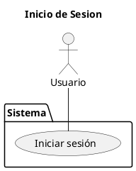

   - UC-02: Cerrar sesión.

| **Especificación de caso de uso** | |
|-----------------------------------|-|
| **Nombre:**                       | Cerrar sesión |
| **Código:**                       | UC-02 |
| **Descripción:**                  | Permite a los usuarios cerrar su sesión en el sistema. |
| **Actores:**                      | Todos los usuarios |
| **Precondiciones:**               | El usuario debe haber iniciado sesión. |
| **Flujo normal:**                 | 1. El usuario selecciona la opción "Cerrar sesión". <br> 2. El sistema cierra la sesión y redirige al usuario a la página de inicio de sesión. |
| **Flujo Alternativo:**            | Ninguno. |
| **Poscondiciones:**               | El usuario ha cerrado sesión correctamente. |


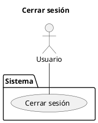

   - UC-03: Cambiar contraseña.

   | **Especificación de caso de uso** | |
|-----------------------------------|-|
| **Nombre:**                       | Cambiar contraseña |
| **Código:**                       | UC-03 |
| **Descripción:**                  | Permite a los usuarios cambiar su contraseña. |
| **Actores:**                      | Todos los usuarios |
| **Precondiciones:**               | El usuario debe haber iniciado sesión. |
| **Flujo normal:**                 | 1. El usuario selecciona la opción "Cambiar contraseña". <br> 2. El sistema solicita la contraseña actual y la nueva contraseña. <br> 3. El usuario ingresa los datos y confirma el cambio. <br> 4. El sistema actualiza la contraseña. |
| **Flujo Alternativo:**            | **Contraseña actual incorrecta:** Si la contraseña actual es incorrecta, el sistema muestra un mensaje de error. |
| **Poscondiciones:**               | La contraseña del usuario ha sido actualizada. |


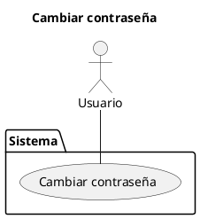

   - UC-04: Crear usuarios.

   | **Especificación de caso de uso** | |
|-----------------------------------|-|
| **Nombre:**                       | Crear usuarios |
| **Código:**                       | UC-04 |
| **Descripción:**                  | Permite al administrador crear nuevos usuarios en el sistema. |
| **Actores:**                      | Administrador |
| **Precondiciones:**               | El administrador debe haber iniciado sesión. |
| **Flujo normal:**                 | 1. El administrador selecciona "Crear usuario". <br> 2. El sistema solicita los datos del nuevo usuario (nombre, correo, rol, etc.). <br> 3. El administrador ingresa los datos y confirma la creación. <br> 4. El sistema registra al nuevo usuario. |
| **Flujo Alternativo:**            | **Datos inválidos:** Si los datos ingresados son inválidos, el sistema muestra un mensaje de error. |
| **Poscondiciones:**               | El nuevo usuario ha sido creado en el sistema. |


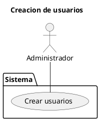

   - UC-05: Gestionar roles.

   | **Especificación de caso de uso** | |
|-----------------------------------|-|
| **Nombre:**                       | Gestionar roles |
| **Código:**                       | UC-05 |
| **Descripción:**                  | Permite al administrador asignar o modificar roles y permisos de usuarios. |
| **Actores:**                      | Administrador |
| **Precondiciones:**               | El administrador debe haber iniciado sesión. |
| **Flujo normal:**                 | 1. El administrador selecciona un usuario. <br> 2. El sistema muestra los roles disponibles. <br> 3. El administrador asigna o modifica el rol del usuario. <br> 4. El sistema actualiza los permisos del usuario. |
| **Flujo Alternativo:**            | **Rol no válido:** Si el rol seleccionado no es válido, el sistema muestra un mensaje de error. |
| **Poscondiciones:**               | Los roles y permisos del usuario han sido actualizados. |


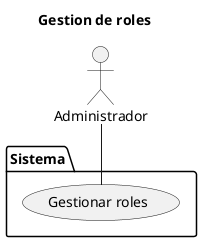

   - UC-06: Eliminar usuarios.

   | **Especificación de caso de uso** | |
|-----------------------------------|-|
| **Nombre:**                       | Eliminar usuarios |
| **Código:**                       | UC-06 |
| **Descripción:**                  | Permite al administrador eliminar usuarios del sistema. |
| **Actores:**                      | Administrador |
| **Precondiciones:**               | El administrador debe haber iniciado sesión. |
| **Flujo normal:**                 | 1. El administrador selecciona un usuario. <br> 2. El sistema solicita confirmación para eliminar al usuario. <br> 3. El administrador confirma la eliminación. <br> 4. El sistema elimina al usuario. |
| **Flujo Alternativo:**            | **Cancelar eliminación:** Si el administrador cancela la acción, el sistema no elimina al usuario. |
| **Poscondiciones:**               | El usuario ha sido eliminado del sistema. |


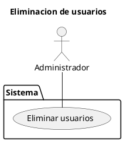

   - UC-07: Registrar estudiante a un curso.

   | **Especificación de caso de uso** | |
|-----------------------------------|-|
| **Nombre:**                       | Registrar estudiante a un curso |
| **Código:**                       | UC-07 |
| **Descripción:**                  | Permite al administrador asignar estudiantes a cursos específicos. |
| **Actores:**                      | Administrador |
| **Precondiciones:**               | El administrador debe haber iniciado sesión. |
| **Flujo normal:**                 | 1. El administrador selecciona un estudiante. <br> 2. El sistema muestra la lista de cursos disponibles. <br> 3. El administrador asigna al estudiante a un curso. <br> 4. El sistema registra la asignación. |
| **Flujo Alternativo:**            | **Curso no disponible:** Si no hay cursos disponibles, el sistema muestra un mensaje de error. |
| **Poscondiciones:**               | El estudiante ha sido asignado a un curso. |


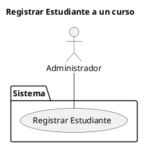

   - UC-08: Registrar estudiante a un grupo.

   | **Especificación de caso de uso** | |
|-----------------------------------|-|
| **Nombre:**                       | Registrar estudiante a un grupo |
| **Código:**                       | UC-08 |
| **Descripción:**                  | Permite al administrador asignar estudiantes a grupos específicos. |
| **Actores:**                      | Administrador |
| **Precondiciones:**               | El administrador debe haber iniciado sesión. |
| **Flujo normal:**                 | 1. El administrador selecciona un estudiante. <br> 2. El sistema muestra la lista de grupos disponibles. <br> 3. El administrador asigna al estudiante a un grupo. <br> 4. El sistema registra la asignación. |
| **Flujo Alternativo:**            | **Grupo no disponible:** Si no hay grupos disponibles, el sistema muestra un mensaje de error. |
| **Poscondiciones:**               | El estudiante ha sido asignado a un grupo. |


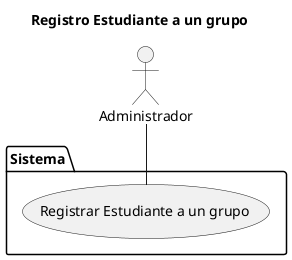

   - UC-09: Modificar información de estudiantes.

   | **Especificación de caso de uso** | |
|-----------------------------------|-|
| **Nombre:**                       | Modificar información de estudiantes |
| **Código:**                       | UC-09 |
| **Descripción:**                  | Permite al administrador actualizar la información de los estudiantes. |
| **Actores:**                      | Administrador |
| **Precondiciones:**               | El administrador debe haber iniciado sesión. |
| **Flujo normal:**                 | 1. El administrador selecciona un estudiante. <br> 2. El sistema muestra la información actual del estudiante. <br> 3. El administrador modifica la información y confirma los cambios. <br> 4. El sistema actualiza la información del estudiante. |
| **Flujo Alternativo:**            | **Datos inválidos:** Si los datos ingresados son inválidos, el sistema muestra un mensaje de error. |
| **Poscondiciones:**               | La información del estudiante ha sido actualizada. |


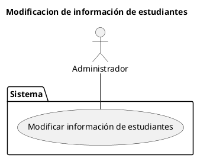

   - UC-10: Solicitar actualización de información.

   | **Especificación de caso de uso** | |
|-----------------------------------|-|
| **Nombre:**                       | Solicitar actualización de información |
| **Código:**                       | UC-10 |
| **Descripción:**                  | Permite a docentes y estudiantes solicitar cambios en su información personal. |
| **Actores:**                      | Docentes, Estudiantes |
| **Precondiciones:**               | El usuario debe haber iniciado sesión. |
| **Flujo normal:**                 | 1. El usuario selecciona "Solicitar actualización de información". <br> 2. El sistema muestra el formulario de solicitud. <br> 3. El usuario ingresa los cambios solicitados y envía la solicitud. <br> 4. El sistema registra la solicitud para su revisión. |
| **Flujo Alternativo:**            | **Datos inválidos:** Si los datos ingresados son inválidos, el sistema muestra un mensaje de error. |
| **Poscondiciones:**               | La solicitud de actualización ha sido enviada. |


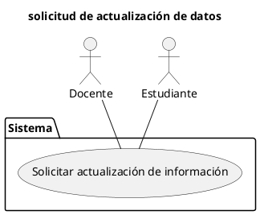

   - UC-11: Consultar información de estudiantes.

   | **Especificación de caso de uso** | |
|-----------------------------------|-|
| **Nombre:**                       | Consultar información de estudiantes |
| **Código:**                       | UC-11 |
| **Descripción:**                  | Permite a administradores y docentes consultar la información de los estudiantes. |
| **Actores:**                      | Administradores, Docentes |
| **Precondiciones:**               | El usuario debe haber iniciado sesión. |
| **Flujo normal:**                 | 1. El usuario selecciona "Consultar información de estudiantes". <br> 2. El sistema muestra la lista de estudiantes. <br> 3. El usuario selecciona un estudiante y consulta su información. |
| **Flujo Alternativo:**            | **Estudiante no encontrado:** Si el estudiante no existe, el sistema muestra un mensaje de error. |
| **Poscondiciones:**               | El usuario ha consultado la información del estudiante. |


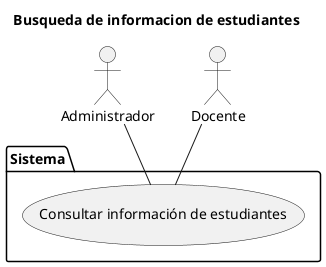


2. **Gestión de Asignaturas y Cursos**:
   - UC-12: Registrar asignaturas.

| **Especificación de caso de uso** | |
|-----------------------------------|-|
| **Nombre:**                       | Registrar asignaturas |
| **Código:**                       | UC-12 |
| **Descripción:**                  | Permite al administrador registrar nuevas asignaturas en el sistema. |
| **Actores:**                      | Administrador |
| **Precondiciones:**               | El administrador debe haber iniciado sesión. |
| **Flujo normal:**                 | 1. El administrador selecciona "Registrar asignatura". <br> 2. El sistema solicita los datos de la asignatura (nombre, código, etc.). <br> 3. El administrador ingresa los datos y confirma el registro. <br> 4. El sistema registra la asignatura. |
| **Flujo Alternativo:**            | **Datos inválidos:** Si los datos ingresados son inválidos, el sistema muestra un mensaje de error. |
| **Poscondiciones:**               | La asignatura ha sido registrada en el sistema. |


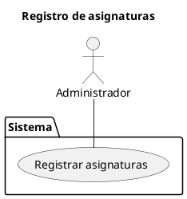

   - UC-13: Asignar docentes a asignaturas y grupos.

   | **Especificación de caso de uso** | |
|-----------------------------------|-|
| **Nombre:**                       | Asignar docentes a asignaturas y grupos |
| **Código:**                       | UC-13 |
| **Descripción:**                  | Permite al administrador asignar docentes a asignaturas y grupos específicos. |
| **Actores:**                      | Administrador |
| **Precondiciones:**               | El administrador debe haber iniciado sesión. |
| **Flujo normal:**                 | 1. El administrador selecciona una asignatura y un grupo. <br> 2. El sistema muestra la lista de docentes disponibles. <br> 3. El administrador asigna un docente a la asignatura y grupo. <br> 4. El sistema registra la asignación. |
| **Flujo Alternativo:**            | **Docente no disponible:** Si no hay docentes disponibles, el sistema muestra un mensaje de error. |
| **Poscondiciones:**               | El docente ha sido asignado a la asignatura y grupo. |


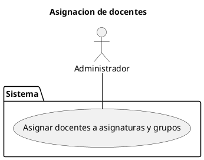
   - UC-14: Consultar asignaturas por curso.

   | **Especificación de caso de uso** | |
|-----------------------------------|-|
| **Nombre:**                       | Consultar asignaturas por curso |
| **Código:**                       | UC-14 |
| **Descripción:**                  | Permite a administradores, docentes y estudiantes consultar las asignaturas de un curso específico. |
| **Actores:**                      | Administradores, Docentes, Estudiantes |
| **Precondiciones:**               | El usuario debe haber iniciado sesión. |
| **Flujo normal:**                 | 1. El usuario selecciona "Consultar asignaturas por curso". <br> 2. El sistema muestra la lista de cursos. <br> 3. El usuario selecciona un curso y consulta las asignaturas asociadas. |
| **Flujo Alternativo:**            | **Curso no encontrado:** Si el curso no existe, el sistema muestra un mensaje de error. |
| **Poscondiciones:**               | El usuario ha consultado las asignaturas del curso. |


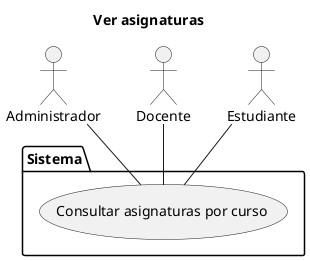

3. **Gestión de Notas**:
   - UC-15: Registrar notas de los estudiantes.

   | **Especificación de caso de uso** | |
|-----------------------------------|-|
| **Nombre:**                       | Registrar notas de los estudiantes |
| **Código:**                       | UC-15 |
| **Descripción:**                  | Permite a los docentes registrar las notas de los estudiantes. |
| **Actores:**                      | Docentes |
| **Precondiciones:**               | El docente debe haber iniciado sesión. |
| **Flujo normal:**                 | 1. El docente selecciona una asignatura y un grupo. <br> 2. El sistema muestra la lista de estudiantes. <br> 3. El docente ingresa las notas de cada estudiante y confirma el registro. <br> 4. El sistema registra las notas. |
| **Flujo Alternativo:**            | **Notas inválidas:** Si las notas ingresadas están fuera del rango permitido, el sistema muestra un mensaje de error. |
| **Poscondiciones:**               | Las notas de los estudiantes han sido registradas. |


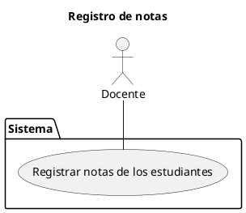

   - UC-16: Editar notas.

   | **Especificación de caso de uso** | |
|-----------------------------------|-|
| **Nombre:**                       | Editar notas |
| **Código:**                       | UC-16 |
| **Descripción:**                  | Permite a los docentes editar las notas de los estudiantes. |
| **Actores:**                      | Docentes |
| **Precondiciones:**               | El docente debe haber iniciado sesión. |
| **Flujo normal:**                 | 1. El docente selecciona una asignatura y un grupo. <br> 2. El sistema muestra la lista de estudiantes con sus notas. <br> 3. El docente modifica las notas y confirma los cambios. <br> 4. El sistema actualiza las notas. |
| **Flujo Alternativo:**            | **Notas inválidas:** Si las notas ingresadas están fuera del rango permitido, el sistema muestra un mensaje de error. |
| **Poscondiciones:**               | Las notas de los estudiantes han sido actualizadas. |


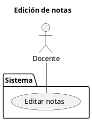

   - UC-17: Consultar notas.

   | **Especificación de caso de uso** | |
|-----------------------------------|-|
| **Nombre:**                       | Consultar notas |
| **Código:**                       | UC-17 |
| **Descripción:**                  | Permite a docentes y estudiantes consultar las notas de los estudiantes. |
| **Actores:**                      | Docentes, Estudiantes |
| **Precondiciones:**               | El usuario debe haber iniciado sesión. |
| **Flujo normal:**                 | 1. El usuario selecciona "Consultar notas". <br> 2. El sistema muestra las notas del estudiante o grupo seleccionado. |
| **Flujo Alternativo:**            | **Notas no disponibles:** Si no hay notas registradas, el sistema muestra un mensaje de error. |
| **Poscondiciones:**               | El usuario ha consultado las notas correctamente. |


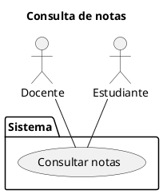
   - UC-18: Generar reportes de notas.

   | **Especificación de caso de uso** | |
|-----------------------------------|-|
| **Nombre:**                       | Generar reportes de notas |
| **Código:**                       | UC-18 |
| **Descripción:**                  | Permite a administradores y docentes generar reportes de notas de los estudiantes. |
| **Actores:**                      | Administradores, Docentes |
| **Precondiciones:**               | El usuario debe haber iniciado sesión. |
| **Flujo normal:**                 | 1. El usuario selecciona "Generar reporte de notas". <br> 2. El sistema solicita los parámetros del reporte (curso, grupo, período, etc.). <br> 3. El usuario ingresa los parámetros y confirma la generación. <br> 4. El sistema genera y muestra el reporte. |
| **Flujo Alternativo:**            | **Datos insuficientes:** Si no hay suficientes datos para generar el reporte, el sistema muestra un mensaje de error. |
| **Poscondiciones:**               | El reporte de notas ha sido generado y está disponible para su consulta. |


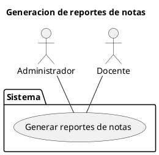

4. **Gestión de Asistencia**:
   - UC-19: Registrar asistencia de los estudiantes.

| **Especificación de caso de uso** | |
|-----------------------------------|-|
| **Nombre:**                       | Registrar asistencia de los estudiantes |
| **Código:**                       | UC-19 |
| **Descripción:**                  | Permite a los docentes registrar la asistencia de los estudiantes. |
| **Actores:**                      | Docentes |
| **Precondiciones:**               | El docente debe haber iniciado sesión. |
| **Flujo normal:**                 | 1. El docente selecciona una asignatura y un grupo. <br> 2. El sistema muestra la lista de estudiantes. <br> 3. El docente registra la asistencia de cada estudiante (presente, ausente, justificado). <br> 4. El sistema guarda los registros de asistencia. |
| **Flujo Alternativo:**            | **Asistencia ya registrada:** Si la asistencia ya fue registrada para esa fecha, el sistema muestra un mensaje de error. |
| **Poscondiciones:**               | La asistencia de los estudiantes ha sido registrada. |


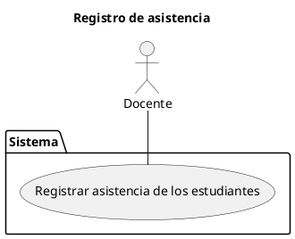
   - UC-20: Editar asistenciaS.

   | **Especificación de caso de uso** | |
|-----------------------------------|-|
| **Nombre:**                       | Editar asistencias |
| **Código:**                       | UC-20 |
| **Descripción:**                  | Permite a los docentes editar los registros de asistencia de los estudiantes. |
| **Actores:**                      | Docentes |
| **Precondiciones:**               | El docente debe haber iniciado sesión. |
| **Flujo normal:**                 | 1. El docente selecciona una asignatura y un grupo. <br> 2. El sistema muestra los registros de asistencia. <br> 3. El docente modifica los registros y confirma los cambios. <br> 4. El sistema actualiza los registros de asistencia. |
| **Flujo Alternativo:**            | **Registro no encontrado:** Si no hay registros de asistencia, el sistema muestra un mensaje de error. |
| **Poscondiciones:**               | Los registros de asistencia han sido actualizados. |


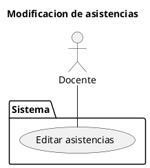

   - UC-21: Consultar asistencia.

   | **Especificación de caso de uso** | |
|-----------------------------------|-|
| **Nombre:**                       | Consultar asistencia |
| **Código:**                       | UC-21 |
| **Descripción:**                  | Permite a administradores, docentes y estudiantes consultar los registros de asistencia. |
| **Actores:**                      | Administradores, Docentes, Estudiantes |
| **Precondiciones:**               | El usuario debe haber iniciado sesión. |
| **Flujo normal:**                 | 1. El usuario selecciona "Consultar asistencia". <br> 2. El sistema muestra los registros de asistencia del estudiante o grupo seleccionado. |
| **Flujo Alternativo:**            | **Asistencia no disponible:** Si no hay registros de asistencia, el sistema muestra un mensaje de error. |
| **Poscondiciones:**               | El usuario ha consultado los registros de asistencia. |


```plantuml
@startuml
title Cosulta de asistencia
actor "Administrador" as Administrador
actor "Docente" as Docente
actor "Estudiante" as Estudiante

package Sistema{
usecase "Consultar asistencia" as UC21
Administrador -- UC21
Docente -- UC21
Estudiante -- UC21
}
@enduml
```

---

## Modelo de Dominio

El modelo de dominio del sistema se representa mediante diagramas UML que describen las relaciones entre las entidades principales, como **Usuario**, **Administrador**, **Docente**, **Estudiante**, **Curso**, **Asignatura**, **Grupo**, **Nota**, **Asistencia** y **Horario**.


```plantuml
@startuml
class Usuario {}
class ReporteNotas{}
class HistorialNotas{}
class HistorialAsistencias{}
class Administrador {}
class Docente {}
class Estudiante {}
class Curso {}
class Asignatura {}
class Grupo {}
class Nota {}
class Asistencia {}
class Horario{}

Usuario <|-- Administrador
Usuario <|-- Docente
Usuario <|-- Estudiante

Grupo o-- Estudiante
Curso <|-- Grupo
Grupo o-- Horario
Horario o-- Asignatura
Asignatura o-- Docente
Asignatura o-- Nota


Nota o-- Estudiante
HistorialNotas o-- Nota

Administrador o-- Curso
Administrador o-- Usuario
Administrador o-- ReporteNotas

ReporteNotas o-- HistorialNotas
ReporteNotas o-- HistorialAsistencias

Docente o-- Asistencia
Asistencia o-- Estudiante
Estudiante o-- HistorialAsistencias
Asistencia --o HistorialAsistencias

@enduml
```

## Diagramas de Robustez

Cada uno de los diagramas de Robustez son por cada caso de uso:

- Iniciar sesión


```plantuml
@startuml
control "ControladorAutenticacion" as ControladorAutenticacion
entity "Usuario" as Usuario
boundary "LoginUI" as LoginUI

actor "Usuario" as ActorUsuario

ActorUsuario --> LoginUI : "Ingresa credenciales"
LoginUI --> ControladorAutenticacion : "Envía datos"
ControladorAutenticacion --> Usuario : "Valida credenciales"
ControladorAutenticacion --> LoginUI : "Muestra resultado"
@enduml
```

- Cerrar sesión


```plantuml
@startuml
control "ControladorSesion" as ControladorSesion
entity "Usuario" as Usuario
boundary "LogoutUI" as LogoutUI

actor "Usuario" as ActorUsuario

ActorUsuario --> LogoutUI : "Solicita cerrar sesión"
LogoutUI --> ControladorSesion : "Envía solicitud"
ControladorSesion --> Usuario : "Cierra sesión"
ControladorSesion --> LogoutUI : "Confirma cierre"
@enduml
```

- Cambiar contraseña


```plantuml
@startuml
control "ControladorContraseña" as ControladorContraseña
entity "Usuario" as Usuario
boundary "CambiarContraseñaUI" as CambiarContraseñaUI

actor "Usuario" as ActorUsuario

ActorUsuario --> CambiarContraseñaUI : "Ingresa nueva contraseña"
CambiarContraseñaUI --> ControladorContraseña : "Envía datos"
ControladorContraseña --> Usuario : "Actualiza contraseña"
ControladorContraseña --> CambiarContraseñaUI : "Confirma cambio"
@enduml
```

- Crear usuarios


```plantuml
@startuml
control "ControladorUsuario" as ControladorUsuario
entity "Usuario" as Usuario
boundary "CrearUsuarioUI" as CrearUsuarioUI

actor "Administrador" as ActorAdmin

ActorAdmin --> CrearUsuarioUI : "Ingresa datos del usuario"
CrearUsuarioUI --> ControladorUsuario : "Envía datos"
ControladorUsuario --> Usuario : "Crea nuevo usuario"
ControladorUsuario --> CrearUsuarioUI : "Confirma creación"
@enduml
```

- Gestionar roles


```plantuml
@startuml
control "ControladorRoles" as ControladorRoles
entity "Usuario" as Usuario
boundary "GestionarRolesUI" as GestionarRolesUI

actor "Administrador" as ActorAdmin

ActorAdmin --> GestionarRolesUI : "Selecciona usuario y rol"
GestionarRolesUI --> ControladorRoles : "Envía datos"
ControladorRoles --> Usuario : "Asigna/Modifica rol"
ControladorRoles --> GestionarRolesUI : "Confirma operación"
@enduml
```

- Eliminar usuarios


```plantuml
@startuml
control "ControladorUsuario" as ControladorUsuario
entity "Usuario" as Usuario
boundary "EliminarUsuarioUI" as EliminarUsuarioUI

actor "Administrador" as ActorAdmin

ActorAdmin --> EliminarUsuarioUI : "Selecciona usuario a eliminar"
EliminarUsuarioUI --> ControladorUsuario : "Envía solicitud"
ControladorUsuario --> Usuario : "Elimina usuario"
ControladorUsuario --> EliminarUsuarioUI : "Confirma eliminación"
@enduml
```

- Registrar estudiante a un curso


```plantuml
@startuml
control "ControladorCurso" as ControladorCurso
entity "Estudiante" as Estudiante
entity "Curso" as Curso
boundary "RegistrarEstudianteUI" as RegistrarEstudianteUI

actor "Administrador" as ActorAdmin

ActorAdmin --> RegistrarEstudianteUI : "Selecciona estudiante y curso"
RegistrarEstudianteUI --> ControladorCurso : "Envía datos"
ControladorCurso --> Estudiante : "Registra en curso"
ControladorCurso --> Curso : "Actualiza lista de estudiantes"
ControladorCurso --> RegistrarEstudianteUI : "Confirma registro"
@enduml
```

- Registrar estudiante a un grupo


```plantuml
@startuml
control "ControladorGrupo" as ControladorGrupo
entity "Estudiante" as Estudiante
entity "Grupo" as Grupo
boundary "RegistrarGrupoUI" as RegistrarGrupoUI

actor "Administrador" as ActorAdmin

ActorAdmin --> RegistrarGrupoUI : "Selecciona estudiante y grupo"
RegistrarGrupoUI --> ControladorGrupo : "Envía datos"
ControladorGrupo --> Estudiante : "Registra en grupo"
ControladorGrupo --> Grupo : "Actualiza lista de estudiantes"
ControladorGrupo --> RegistrarGrupoUI : "Confirma registro"
@enduml
```

- Modificar información de estudiantes


```plantuml
@startuml
control "ControladorEstudiante" as ControladorEstudiante
entity "Estudiante" as Estudiante
boundary "ModificarEstudianteUI" as ModificarEstudianteUI

actor "Administrador" as ActorAdmin

ActorAdmin --> ModificarEstudianteUI : "Ingresa nuevos datos"
ModificarEstudianteUI --> ControladorEstudiante : "Envía datos"
ControladorEstudiante --> Estudiante : "Actualiza información"
ControladorEstudiante --> ModificarEstudianteUI : "Confirma cambios"
@enduml
```

- Solicitar actualización de información


```plantuml
@startuml
control "ControladorSolicitud" as ControladorSolicitud
entity "Usuario" as Usuario
boundary "SolicitarActualizacionUI" as SolicitarActualizacionUI

actor "Usuario" as ActorUsuario

ActorUsuario --> SolicitarActualizacionUI : "Ingresa solicitud"
SolicitarActualizacionUI --> ControladorSolicitud : "Envía solicitud"
ControladorSolicitud --> Usuario : "Registra solicitud"
ControladorSolicitud --> SolicitarActualizacionUI : "Confirma recepción"
@enduml
```

- Consultar información de estudiantes


```plantuml
@startuml
control "ControladorConsulta" as ControladorConsulta
entity "Estudiante" as Estudiante
boundary "ConsultarEstudianteUI" as ConsultarEstudianteUI

actor "Administrador/Docente" as ActorAdminDocente

ActorAdminDocente --> ConsultarEstudianteUI : "Solicita información"
ConsultarEstudianteUI --> ControladorConsulta : "Envía solicitud"
ControladorConsulta --> Estudiante : "Obtiene información"
ControladorConsulta --> ConsultarEstudianteUI : "Muestra resultados"
@enduml
```

- Registrar asignaturas


```plantuml
@startuml
control "ControladorAsignatura" as ControladorAsignatura
entity "Asignatura" as Asignatura
boundary "RegistrarAsignaturaUI" as RegistrarAsignaturaUI

actor "Administrador" as ActorAdmin

ActorAdmin --> RegistrarAsignaturaUI : "Ingresa datos de asignatura"
RegistrarAsignaturaUI --> ControladorAsignatura : "Envía datos"
ControladorAsignatura --> Asignatura : "Crea nueva asignatura"
ControladorAsignatura --> RegistrarAsignaturaUI : "Confirma creación"
@enduml
```

- Asignar docentes a asignaturas y grupos


```plantuml
@startuml
control "ControladorAsignacion" as ControladorAsignacion
entity "Docente" as Docente
entity "Asignatura" as Asignatura
entity "Grupo" as Grupo
boundary "AsignarDocenteUI" as AsignarDocenteUI

actor "Administrador" as ActorAdmin

ActorAdmin --> AsignarDocenteUI : "Selecciona docente, asignatura y grupo"
AsignarDocenteUI --> ControladorAsignacion : "Envía datos"
ControladorAsignacion --> Docente : "Asigna a asignatura y grupo"
ControladorAsignacion --> Asignatura : "Actualiza lista de docentes"
ControladorAsignacion --> Grupo : "Actualiza lista de docentes"
ControladorAsignacion --> AsignarDocenteUI : "Confirma asignación"
@enduml
```

- Consultar asignaturas por curso


```plantuml
@startuml
control "ControladorAsignatura" as ControladorAsignatura
entity "Asignatura" as Asignatura
entity "Curso" as Curso
boundary "ConsultarAsignaturaUI" as ConsultarAsignaturaUI

actor "Usuario" as ActorUsuario

ActorUsuario --> ConsultarAsignaturaUI : "Solicita información"
ConsultarAsignaturaUI --> ControladorAsignatura : "Envía solicitud"
ControladorAsignatura --> Curso : "Obtiene curso"
ControladorAsignatura --> Asignatura : "Obtiene asignaturas"
ControladorAsignatura --> ConsultarAsignaturaUI : "Muestra resultados"
@enduml
```

- Registrar notas de los estudiantes


```plantuml
@startuml
control "ControladorNotas" as ControladorNotas
entity "Estudiante" as Estudiante
entity "Nota" as Nota
boundary "RegistrarNotaUI" as RegistrarNotaUI

actor "Docente" as ActorDocente

ActorDocente --> RegistrarNotaUI : "Ingresa nota"
RegistrarNotaUI --> ControladorNotas : "Envía datos"
ControladorNotas --> Estudiante : "Registra nota"
ControladorNotas --> Nota : "Almacena nota"
ControladorNotas --> RegistrarNotaUI : "Confirma registro"
@enduml
```

- Editar notas


```plantuml
@startuml
control "ControladorNotas" as ControladorNotas
entity "Nota" as Nota
boundary "EditarNotaUI" as EditarNotaUI

actor "Docente" as ActorDocente

ActorDocente --> EditarNotaUI : "Selecciona nota y modifica"
EditarNotaUI --> ControladorNotas : "Envía datos"
ControladorNotas --> Nota : "Actualiza nota"
ControladorNotas --> EditarNotaUI : "Confirma cambios"
@enduml
```

- Consultar notas


```plantuml
@startuml
control "ControladorNotas" as ControladorNotas
entity "Nota" as Nota
boundary "ConsultarNotaUI" as ConsultarNotaUI

actor "Usuario" as ActorUsuario

ActorUsuario --> ConsultarNotaUI : "Solicita notas"
ConsultarNotaUI --> ControladorNotas : "Envía solicitud"
ControladorNotas --> Nota : "Obtiene notas"
ControladorNotas --> ConsultarNotaUI : "Muestra resultados"
@enduml
```

- Generar reportes de notas


```plantuml
@startuml
control "ControladorReportes" as ControladorReportes
entity "Nota" as Nota
boundary "GenerarReporteUI" as GenerarReporteUI

actor "Usuario" as ActorUsuario

ActorUsuario --> GenerarReporteUI : "Solicita reporte"
GenerarReporteUI --> ControladorReportes : "Envía solicitud"
ControladorReportes --> Nota : "Obtiene datos"
ControladorReportes --> GenerarReporteUI : "Genera y muestra reporte"
@enduml
```

- Registrar asistencia de los estudiantes


```plantuml
@startuml
control "ControladorAsistencia" as ControladorAsistencia
entity "Estudiante" as Estudiante
entity "Asistencia" as Asistencia
boundary "RegistrarAsistenciaUI" as RegistrarAsistenciaUI

actor "Docente" as ActorDocente

ActorDocente --> RegistrarAsistenciaUI : "Registra asistencia"
RegistrarAsistenciaUI --> ControladorAsistencia : "Envía datos"
ControladorAsistencia --> Estudiante : "Registra asistencia"
ControladorAsistencia --> Asistencia : "Almacena registro"
ControladorAsistencia --> RegistrarAsistenciaUI : "Confirma registro"
@enduml
```

- Editar asistencias


```plantuml
@startuml
control "ControladorAsistencia" as ControladorAsistencia
entity "Asistencia" as Asistencia
boundary "EditarAsistenciaUI" as EditarAsistenciaUI

actor "Docente" as ActorDocente

ActorDocente --> EditarAsistenciaUI : "Selecciona y modifica asistencia"
EditarAsistenciaUI --> ControladorAsistencia : "Envía datos"
ControladorAsistencia --> Asistencia : "Actualiza asistencia"
ControladorAsistencia --> EditarAsistenciaUI : "Confirma cambios"
@enduml
```

- Consultar asistencia


```plantuml
@startuml
control "ControladorAsistencia" as ControladorAsistencia
entity "Asistencia" as Asistencia
boundary "ConsultarAsistenciaUI" as ConsultarAsistenciaUI

actor "Usuario" as ActorUsuario

ActorUsuario --> ConsultarAsistenciaUI : "Solicita asistencia"
ConsultarAsistenciaUI --> ControladorAsistencia : "Envía solicitud"
ControladorAsistencia --> Asistencia : "Obtiene datos"
ControladorAsistencia --> ConsultarAsistenciaUI : "Muestra resultados"
@enduml
```

## Diagramas de Secuencia

Cada diagrama está diseñado para representar las interacciones entre los objetos y actores en un escenario específico.

- Iniciar sesión


```plantuml
@startuml
actor Usuario as Usuario
boundary "Interfaz Login" as LoginUI
control "ControladorAutenticacion" as CtrlAutenticacion
entity "BaseDeDatos" as BaseDeDatos

Usuario -> LoginUI : Ingresa credenciales
LoginUI -> CtrlAutenticacion : Envía credenciales
CtrlAutenticacion -> BaseDeDatos : Consulta usuario
BaseDeDatos --> CtrlAutenticacion : Devuelve datos del usuario
CtrlAutenticacion --> LoginUI : Confirma autenticación
LoginUI --> Usuario : Muestra resultado
@enduml
```

- Cerrar sesión


```plantuml
@startuml
actor Usuario as Usuario
boundary "Interfaz Logout" as LogoutUI
control "ControladorSesion" as CtrlSesion
entity "BaseDeDatos" as BaseDeDatos

Usuario -> LogoutUI : Solicita cerrar sesión
LogoutUI -> CtrlSesion : Envía solicitud
CtrlSesion -> BaseDeDatos : Cierra sesión
BaseDeDatos --> CtrlSesion : Confirma cierre
CtrlSesion --> LogoutUI : Notifica éxito
LogoutUI --> Usuario : Muestra confirmación
@enduml
```

- Cambiar contraseña


```plantuml
@startuml
actor Usuario as Usuario
boundary "Interfaz CambiarContraseña" as CambiarContraseñaUI
control "ControladorContraseña" as CtrlContraseña
entity "BaseDeDatos" as BaseDeDatos

Usuario -> CambiarContraseñaUI : Ingresa nueva contraseña
CambiarContraseñaUI -> CtrlContraseña : Envía datos
CtrlContraseña -> BaseDeDatos : Actualiza contraseña
BaseDeDatos --> CtrlContraseña : Confirma actualización
CtrlContraseña --> CambiarContraseñaUI : Notifica éxito
CambiarContraseñaUI --> Usuario : Muestra confirmación
@enduml
```

- Crear usuarios


```plantuml
@startuml
actor Administrador as Administrador
boundary "Interfaz CrearUsuario" as CrearUsuarioUI
control "ControladorUsuario" as CtrlUsuario
entity "BaseDeDatos" as BaseDeDatos

Administrador -> CrearUsuarioUI : Ingresa datos del usuario
CrearUsuarioUI -> CtrlUsuario : Envía datos
CtrlUsuario -> BaseDeDatos : Valida y almacena usuario
BaseDeDatos --> CtrlUsuario : Confirma creación
CtrlUsuario --> CrearUsuarioUI : Notifica éxito
CrearUsuarioUI --> Administrador : Muestra confirmación
@enduml
```

- Gestionar roles


```plantuml
@startuml
actor Administrador as Administrador
boundary "Interfaz GestionarRoles" as GestionarRolesUI
control "ControladorRoles" as CtrlRoles
entity "BaseDeDatos" as BaseDeDatos

Administrador -> GestionarRolesUI : Selecciona usuario y rol
GestionarRolesUI -> CtrlRoles : Envía datos
CtrlRoles -> BaseDeDatos : Actualiza rol del usuario
BaseDeDatos --> CtrlRoles : Confirma actualización
CtrlRoles --> GestionarRolesUI : Notifica éxito
GestionarRolesUI --> Administrador : Muestra confirmación
@enduml
```

- Eliminar usuarios


```plantuml
@startuml
actor Administrador as Administrador
boundary "Interfaz EliminarUsuario" as EliminarUsuarioUI
control "ControladorUsuario" as CtrlUsuario
entity "BaseDeDatos" as BaseDeDatos

Administrador -> EliminarUsuarioUI : Selecciona usuario a eliminar
EliminarUsuarioUI -> CtrlUsuario : Envía solicitud
CtrlUsuario -> BaseDeDatos : Elimina usuario
BaseDeDatos --> CtrlUsuario : Confirma eliminación
CtrlUsuario --> EliminarUsuarioUI : Notifica éxito
EliminarUsuarioUI --> Administrador : Muestra confirmación
@enduml
```

- Registrar estudiante a un curso


```plantuml
@startuml
actor Administrador as Administrador
boundary "Interfaz RegistrarEstudiante" as RegistrarEstudianteUI
control "ControladorCurso" as CtrlCurso
entity "BaseDeDatos" as BaseDeDatos

Administrador -> RegistrarEstudianteUI : Selecciona estudiante y curso
RegistrarEstudianteUI -> CtrlCurso : Envía datos
CtrlCurso -> BaseDeDatos : Registra estudiante en curso
BaseDeDatos --> CtrlCurso : Confirma registro
CtrlCurso --> RegistrarEstudianteUI : Notifica éxito
RegistrarEstudianteUI --> Administrador : Muestra confirmación
@enduml
```

- Registrar estudiante a un grupo


```plantuml
@startuml
actor Administrador as Administrador
boundary "Interfaz RegistrarGrupo" as RegistrarGrupoUI
control "ControladorGrupo" as CtrlGrupo
entity "BaseDeDatos" as BaseDeDatos

Administrador -> RegistrarGrupoUI : Selecciona estudiante y grupo
RegistrarGrupoUI -> CtrlGrupo : Envía datos
CtrlGrupo -> BaseDeDatos : Registra estudiante en grupo
BaseDeDatos --> CtrlGrupo : Confirma registro
CtrlGrupo --> RegistrarGrupoUI : Notifica éxito
RegistrarGrupoUI --> Administrador : Muestra confirmación
@enduml
```

- Modificar información de estudiantes


```plantuml
@startuml
actor Administrador as Administrador
boundary "Interfaz ModificarEstudiante" as ModificarEstudianteUI
control "ControladorEstudiante" as CtrlEstudiante
entity "BaseDeDatos" as BaseDeDatos

Administrador -> ModificarEstudianteUI : Ingresa nuevos datos
ModificarEstudianteUI -> CtrlEstudiante : Envía datos
CtrlEstudiante -> BaseDeDatos : Actualiza información
BaseDeDatos --> CtrlEstudiante : Confirma actualización
CtrlEstudiante --> ModificarEstudianteUI : Notifica éxito
ModificarEstudianteUI --> Administrador : Muestra confirmación
@enduml
```

- Solicitar actualización de información


```plantuml
@startuml
actor Usuario as Usuario
boundary "Interfaz SolicitarActualizacion" as SolicitarActualizacionUI
control "ControladorSolicitud" as CtrlSolicitud
entity "BaseDeDatos" as BaseDeDatos

Usuario -> SolicitarActualizacionUI : Ingresa solicitud
SolicitarActualizacionUI -> CtrlSolicitud : Envía solicitud
CtrlSolicitud -> BaseDeDatos : Registra solicitud
BaseDeDatos --> CtrlSolicitud : Confirma registro
CtrlSolicitud --> SolicitarActualizacionUI : Notifica éxito
SolicitarActualizacionUI --> Usuario : Muestra confirmación
@enduml
```

- Consultar información de estudiantes


```plantuml
@startuml
actor Usuario as Usuario
boundary "Interfaz ConsultarEstudiante" as ConsultarEstudianteUI
control "ControladorConsulta" as CtrlConsulta
entity "BaseDeDatos" as BaseDeDatos

Usuario -> ConsultarEstudianteUI : Solicita información
ConsultarEstudianteUI -> CtrlConsulta : Envía solicitud
CtrlConsulta -> BaseDeDatos : Consulta información
BaseDeDatos --> CtrlConsulta : Devuelve datos
CtrlConsulta --> ConsultarEstudianteUI : Muestra resultados
ConsultarEstudianteUI --> Usuario : Muestra información
@enduml
```

- Registrar asignaturas


```plantuml
@startuml
actor Administrador as Administrador
boundary "Interfaz RegistrarAsignatura" as RegistrarAsignaturaUI
control "ControladorAsignatura" as CtrlAsignatura
entity "BaseDeDatos" as BaseDeDatos

Administrador -> RegistrarAsignaturaUI : Ingresa datos de asignatura
RegistrarAsignaturaUI -> CtrlAsignatura : Envía datos
CtrlAsignatura -> BaseDeDatos : Almacena asignatura
BaseDeDatos --> CtrlAsignatura : Confirma almacenamiento
CtrlAsignatura --> RegistrarAsignaturaUI : Notifica éxito
RegistrarAsignaturaUI --> Administrador : Muestra confirmación
@enduml
```

- Asignar docentes a asignaturas y grupos


```plantuml
@startuml
actor Administrador as Administrador
boundary "Interfaz AsignarDocente" as AsignarDocenteUI
control "ControladorAsignacion" as CtrlAsignacion
entity "BaseDeDatos" as BaseDeDatos

Administrador -> AsignarDocenteUI : Selecciona docente, asignatura y grupo
AsignarDocenteUI -> CtrlAsignacion : Envía datos
CtrlAsignacion -> BaseDeDatos : Asigna docente
BaseDeDatos --> CtrlAsignacion : Confirma asignación
CtrlAsignacion --> AsignarDocenteUI : Notifica éxito
AsignarDocenteUI --> Administrador : Muestra confirmación
@enduml
```

- Consultar asignaturas por curso


```plantuml
@startuml
actor Usuario as Usuario
boundary "Interfaz ConsultarAsignatura" as ConsultarAsignaturaUI
control "ControladorAsignatura" as CtrlAsignatura
entity "BaseDeDatos" as BaseDeDatos

Usuario -> ConsultarAsignaturaUI : Solicita información
ConsultarAsignaturaUI -> CtrlAsignatura : Envía solicitud
CtrlAsignatura -> BaseDeDatos : Consulta asignaturas
BaseDeDatos --> CtrlAsignatura : Devuelve datos
CtrlAsignatura --> ConsultarAsignaturaUI : Muestra resultados
ConsultarAsignaturaUI --> Usuario : Muestra información
@enduml
```

- Registrar notas de los estudiantes


```plantuml
@startuml
actor Docente as Docente
boundary "Interfaz RegistrarNota" as RegistrarNotaUI
control "ControladorNotas" as CtrlNotas
entity "BaseDeDatos" as BaseDeDatos

Docente -> RegistrarNotaUI : Ingresa nota
RegistrarNotaUI -> CtrlNotas : Envía datos
CtrlNotas -> BaseDeDatos : Almacena nota
BaseDeDatos --> CtrlNotas : Confirma almacenamiento
CtrlNotas --> RegistrarNotaUI : Notifica éxito
RegistrarNotaUI --> Docente : Muestra confirmación
@enduml
```

- Editar notas


```plantuml
@startuml
actor Docente as Docente
boundary "Interfaz EditarNota" as EditarNotaUI
control "ControladorNotas" as CtrlNotas
entity "BaseDeDatos" as BaseDeDatos

Docente -> EditarNotaUI : Selecciona y modifica nota
EditarNotaUI -> CtrlNotas : Envía datos
CtrlNotas -> BaseDeDatos : Actualiza nota
BaseDeDatos --> CtrlNotas : Confirma actualización
CtrlNotas --> EditarNotaUI : Notifica éxito
EditarNotaUI --> Docente : Muestra confirmación
@enduml
```

- Consultar notas


```plantuml
@startuml
actor Usuario as Usuario
boundary "Interfaz ConsultarNota" as ConsultarNotaUI
control "ControladorNotas" as CtrlNotas
entity "BaseDeDatos" as BaseDeDatos

Usuario -> ConsultarNotaUI : Solicita notas
ConsultarNotaUI -> CtrlNotas : Envía solicitud
CtrlNotas -> BaseDeDatos : Consulta notas
BaseDeDatos --> CtrlNotas : Devuelve datos
CtrlNotas --> ConsultarNotaUI : Muestra resultados
ConsultarNotaUI --> Usuario : Muestra notas
@enduml
```

- Generar reportes de notas


```plantuml
@startuml
actor Usuario as Usuario
boundary "Interfaz GenerarReporte" as GenerarReporteUI
control "ControladorReportes" as CtrlReportes
entity "BaseDeDatos" as BaseDeDatos

Usuario -> GenerarReporteUI : Solicita reporte
GenerarReporteUI -> CtrlReportes : Envía solicitud
CtrlReportes -> BaseDeDatos : Consulta datos
BaseDeDatos --> CtrlReportes : Devuelve datos
CtrlReportes --> GenerarReporteUI : Genera reporte
GenerarReporteUI --> Usuario : Muestra reporte
@enduml
```

- Registrar asistencia de los estudiantes


```plantuml
@startuml
actor Docente as Docente
boundary "Interfaz RegistrarAsistencia" as RegistrarAsistenciaUI
control "ControladorAsistencia" as CtrlAsistencia
entity "BaseDeDatos" as BaseDeDatos

Docente -> RegistrarAsistenciaUI : Registra asistencia
RegistrarAsistenciaUI -> CtrlAsistencia : Envía datos
CtrlAsistencia -> BaseDeDatos : Almacena asistencia
BaseDeDatos --> CtrlAsistencia : Confirma almacenamiento
CtrlAsistencia --> RegistrarAsistenciaUI : Notifica éxito
RegistrarAsistenciaUI --> Docente : Muestra confirmación
@enduml
```

- Editar asistencias


```plantuml
@startuml
actor Docente as Docente
boundary "Interfaz EditarAsistencia" as EditarAsistenciaUI
control "ControladorAsistencia" as CtrlAsistencia
entity "BaseDeDatos" as BaseDeDatos

Docente -> EditarAsistenciaUI : Selecciona y modifica asistencia
EditarAsistenciaUI -> CtrlAsistencia : Envía datos
CtrlAsistencia -> BaseDeDatos : Actualiza asistencia
BaseDeDatos --> CtrlAsistencia : Confirma actualización
CtrlAsistencia --> EditarAsistenciaUI : Notifica éxito
EditarAsistenciaUI --> Docente : Muestra confirmación
@enduml
```

- Consultar asistencia


```plantuml
@startuml
actor Usuario as Usuario
boundary "Interfaz ConsultarAsistencia" as ConsultarAsistenciaUI
control "ControladorAsistencia" as CtrlAsistencia
entity "BaseDeDatos" as BaseDeDatos

Usuario -> ConsultarAsistenciaUI : Solicita asistencia
ConsultarAsistenciaUI -> CtrlAsistencia : Envía solicitud
CtrlAsistencia -> BaseDeDatos : Consulta asistencia
BaseDeDatos --> CtrlAsistencia : Devuelve datos
CtrlAsistencia --> ConsultarAsistenciaUI : Muestra resultados
ConsultarAsistenciaUI --> Usuario : Muestra asistencia
@enduml
```